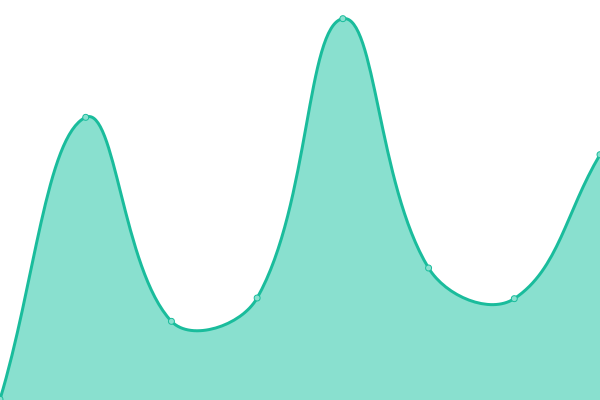

# [📈 Live Status](https://status.chapati.systems): <!--live status--> **🟩 All systems operational**

This repository contains the open-source uptime monitor and status page for [Chapati Systems GmbH](https://chapati.systems/), powered by [Upptime](https://github.com/upptime/upptime).

With [Upptime](https://upptime.js.org), you can get your own unlimited and free uptime monitor and status page, powered entirely by a GitHub repository. We use [Issues](https://github.com/Chapati-Systems/status/issues) as incident reports, [Actions](https://github.com/Chapati-Systems/status/actions) as uptime monitors, and [Pages](https://status.chapati.systems) for the status page.

<!--start: status pages-->
<!-- This summary is generated by Upptime (https://github.com/upptime/upptime) -->
<!-- Do not edit this manually, your changes will be overwritten -->
<!-- prettier-ignore -->
| URL | Status | History | Response Time | Uptime |
| --- | ------ | ------- | ------------- | ------ |
|  [Alphalerts](https://alphalerts.com/) | 🟩 Up | [alphalerts.yml](https://github.com/Chapati-Systems/status/commits/HEAD/history/alphalerts.yml) | 

 1594ms
     
 | 

<a href="https://status.chapati.systems/history/alphalerts">100.00%</a>
    

|  [OS.MONEY](https://os.money) | 🟩 Up | [os-money.yml](https://github.com/Chapati-Systems/status/commits/HEAD/history/os-money.yml) | 

 626ms
     
 | 

<a href="https://status.chapati.systems/history/os-money">100.00%</a>
    

|  [Tasty Stream](https://tasty.stream/) | 🟩 Up | [tasty-stream.yml](https://github.com/Chapati-Systems/status/commits/HEAD/history/tasty-stream.yml) | 

 316ms
     
 | 

<a href="https://status.chapati.systems/history/tasty-stream">100.00%</a>
    

|  Server 1 | 🟩 Up | [server-1.yml](https://github.com/Chapati-Systems/status/commits/HEAD/history/server-1.yml) | 

 603ms
     
 | 

<a href="https://status.chapati.systems/history/server-1">100.00%</a>
    

|  Server 2 | 🟩 Up | [server-2.yml](https://github.com/Chapati-Systems/status/commits/HEAD/history/server-2.yml) | 

 315ms
     
 | 

<a href="https://status.chapati.systems/history/server-2">52.25%</a>
    

|  Gitea | 🟩 Up | [gitea.yml](https://github.com/Chapati-Systems/status/commits/HEAD/history/gitea.yml) | 

 684ms
     
 | 

<a href="https://status.chapati.systems/history/gitea">100.00%</a>
    

|  Kanboard | 🟩 Up | [kanboard.yml](https://github.com/Chapati-Systems/status/commits/HEAD/history/kanboard.yml) | 

 863ms
     
 | 

<a href="https://status.chapati.systems/history/kanboard">100.00%</a>
    

|  Auth Service | 🟩 Up | [auth-service.yml](https://github.com/Chapati-Systems/status/commits/HEAD/history/auth-service.yml) | 

 652ms
     
 | 

<a href="https://status.chapati.systems/history/auth-service">100.00%</a>
    

<!--end: status pages-->

[**Visit our status website →**](https://status.chapati.systems)

## 📄 License

- Powered by: [Upptime](https://github.com/upptime/upptime)
- Code: [MIT](./LICENSE) © [Chapati Systems GmbH](https://chapati.systems/)
- Data in the `./history` directory: [Open Database License](https://opendatacommons.org/licenses/odbl/1-0/)
